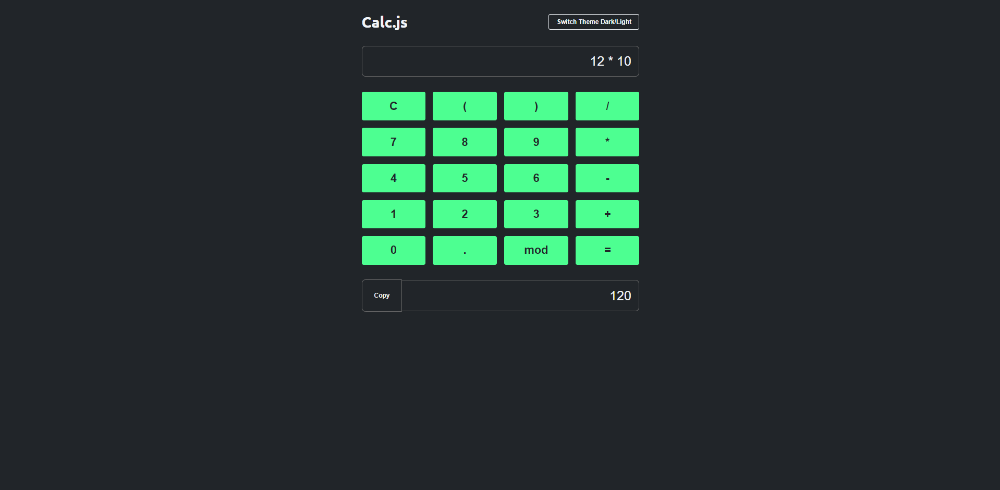
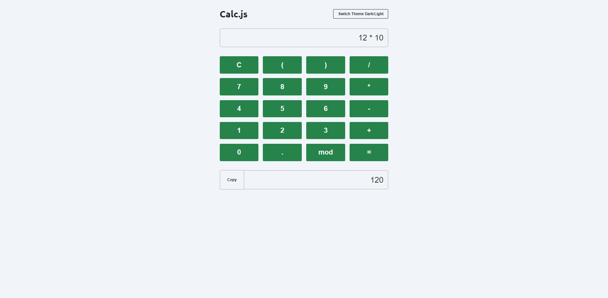

# Calculadora Digital 🧮

# Cálculos + JavaScript 📝

> ## Descrição 📚
Este projeto aborda o desenvolvimento de uma calculadora digital, empregando JavaScript para a execução de cálculos e manipulação do DOM para exibição na interface. A aplicação incorpora funcionalidades como adição, subtração, multiplicação e divisão, proporcionando uma experiência interativa ao usuário.
Além disso, foi implementado um recurso de alternância entre temas claro e escuro, utilizando uma estrutura de switch para possibilitar uma personalização visual da calculadora. Essa funcionalidade proporciona ao usuário a flexibilidade de ajustar o tema conforme suas preferências, garantindo uma experiência adaptada às condições de iluminação ou preferências estéticas.

 
 

> ## Tecnologias 👨🏾‍💻
Foram utilizadas as seguintes tecnologias neste projeto:
+ Front-End :
  -  HTML5
  -  CSS3
  -  JavaScript

 
 

> ## Printscreen do Projeto 📸
# Tema Escuro

# Tema Claro

 
 

> ## Autor 📝
+ [Ruan Cardoso](https://github.com/RuanCxrdoso)
